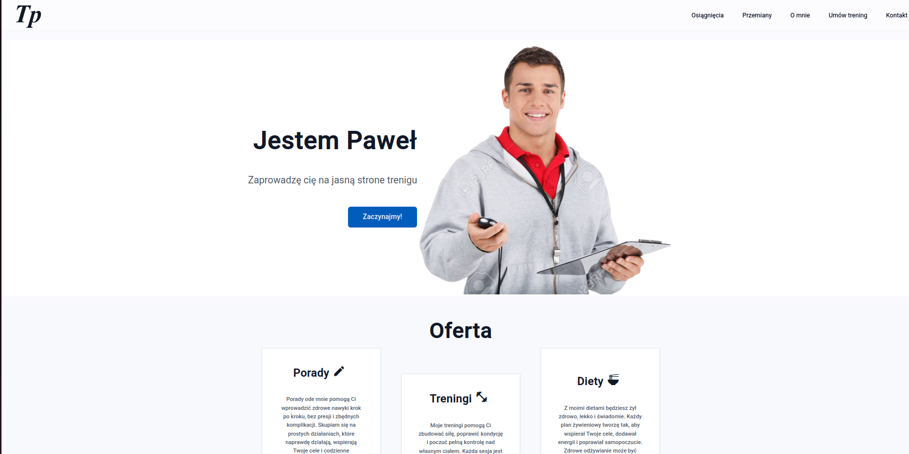
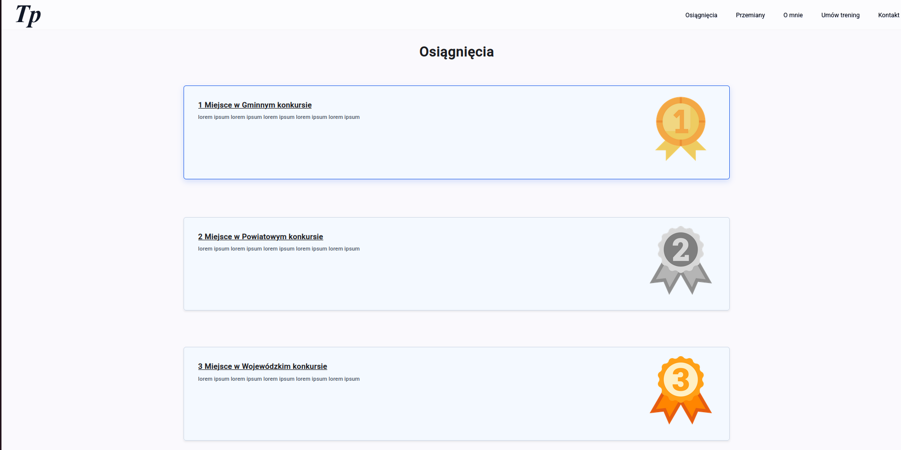

# PersonalTrainerSite

This project was generated using [Angular CLI](https://github.com/angular/angular-cli) version 20.3.5.

This project was created as a task from company Rockezzz

## Docker

You can run this project from docker!

To run this with docker run:

``` docker build -t personal-trainer-site .```

``` docker run -p 4201:4200 personal-trainer-site```

## About the project

Before I started doing the project I created a [figma design](https://www.figma.com/design/eUi74fVp4AWBWXaMMuKpmF/Trener-presonalny-strona?node-id=0-1&m=dev&t=TygYOao5Cj8zmb96-1) of a site and then started developing a project.

Project has 2 sites, 2 services, 6 components and 1 directive.
Header and footer component are used globaly the rest of the components are used in home-site

## Sites

### Home

Home site is main site of the project it is to show my skills in developing an Angular projects.

### Achievements

The only purpose of a achievement site is to show that I can in routing and listing a list from a service.

## Components

### Header

Header component has 2 views, hamburger view and the expanse view. The different view acts dependent on the width of the screen and the achievement button worked. To create a hamburger, I had a help from chatgpt.

### Footer

It's a simple footer with copyrights information, nothing special.

### Carousel

The carousel is a component used to show opinions. There are _bugs_ in the carousel, when the carousel is showing 1 opinion on screen the next opinions are shifted by a few pixels and the width of the carousel is not shrinking after screen has less than 700px. I couldn't fix the first one, but the second is fixed by making buttons hidden.

### Stars

Stars are used in carousel.

### Contact form

Contact form is made to take less code in home page site and make project clearer. Contact form has validation.

### Dialog after form

Dialog after form is a component used for making sure that a user is not a robot. The CAPTCHA is not implemented, but it has space for it.


## Services

Both services Achievements and Opinions are used to get all necessary information. The services are implemented to show that I know what services are and how to implement.

## Directive

Directive CountUp is used to dynamically count up the numbers of site. The directive is copied from this [tutorial](https://dev.to/angular/building-count-up-animation-with-angular-and-rxjs-240k), I added to it an input to show a number when it is visible.

## What would I have done differently?

Before starting making the project, I wanted to create a site divided using a grid, but after some problems and seeing the sites of different personal trainers I decided to create site using a flex. I should first look websites with similar topics and then creating a UI, I would create site faster and more efficient that way.

## What to do in the future

In the future I can make all the sites form the menu.

## Bibliography

All images are from internet

- [trener-main.png](https://pl.123rf.com/photo_23810213_trener-sport-portret-szcz%C4%99%C5%9Bliwy-m%C5%82ody-trener.html)
- [trener.png](https://pl.123rf.com/photo_23810190_trener-koszyk%C3%B3wki-u%C5%9Bmiechni%C4%99ty-trenera-koszyk%C3%B3wki.html)
- [1place.png](https://www.flaticon.com/free-icon/1st-place_4350539)
- [2place.png](https://www.freepik.com/icon/2nd-place_11166477)
- [3place.png](https://www.flaticon.com/free-icon/3rd-place_11166479)
- [facebook icons](https://icons8.com/icons/set/facebook)
- [instagram icons](https://icons8.com/icons/set/instagram)


## Screens





##

All texts in project were generated using chat gpt.

This readme wasn't generated.